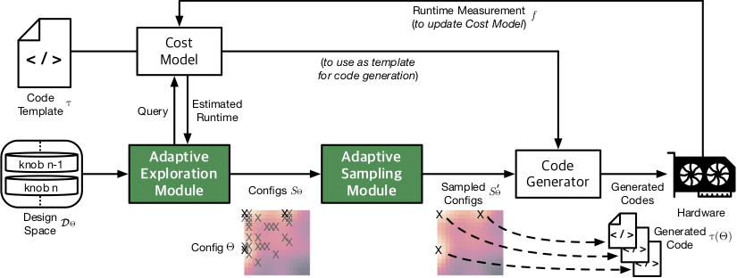
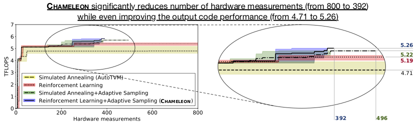

# Chameleon: Adaptive Code Optimization for Expedited Deep Neural Network Compilation

This repository contains the code for "Chameleon: Adaptive Code Optimization for Expedited Deep Neural Network Compilation" in ICLR 2020.

Previous appraches for automated optimizing compilation of deep neural networks relay on either Traditional Compilation Heuristics, Genetic Algorithms, or other Stochastic Methods. However, these methods suffer from frequent costly hardware measurements rendering them not only too time consuming but also suboptimal. We develop and Adaptive approach to replace current methods.

(1) Leverage Reinforcement Learning (RL) whose solution takes fewer steps to converge  
(2) Develop and Adaptive Sampling based on clustering algorithms to focus the costly measurements

__Overview__

__Results__

__Instructions__

1. Clone TVM.  
2. Copy Chameleon to the TVM directory (python/tvm), this package can be used like the AutoTVM.  
3. For rest of the process, follow TVM.

__Link__

OpenReview Forum for Chameleon: https://openreview.net/forum?id=rygG4AVFvH  
TVM: An Automated End-to-End Optimizing Compiler for Deep Learning (OSDI'18): https://tvm.ai  
Learning to Optimize Tensor Programs (AutoTVM, NeurIPS'18): https://papers.nips.cc/paper/7599-learning-to-optimize-tensor-programs.pdf  
